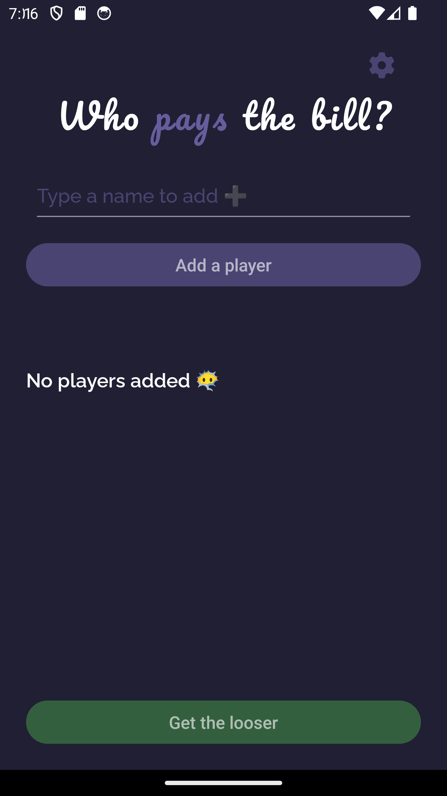
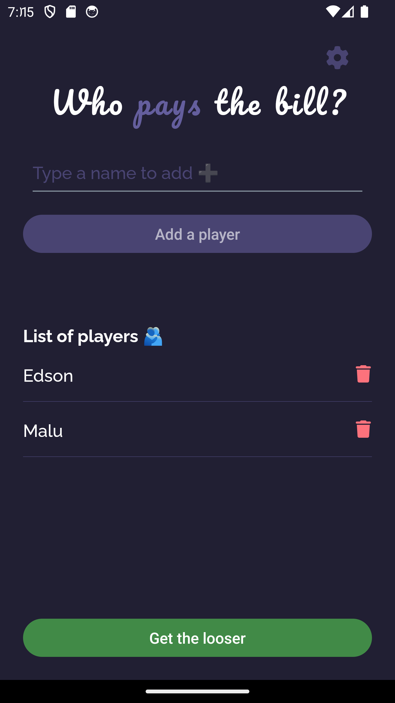
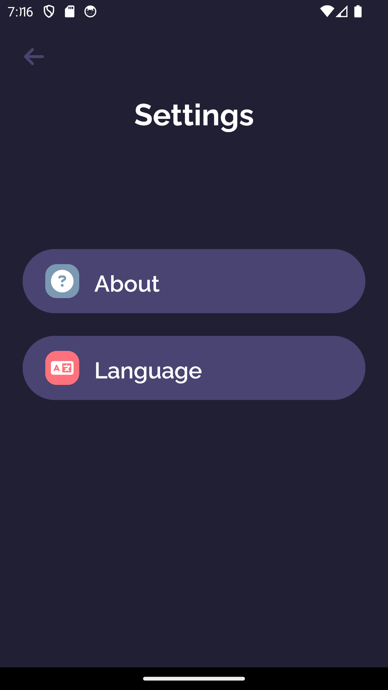

# Who Pays the Bill?


**Who Pays the Bill?** is a fun and lighthearted app to help decide who will foot the bill among friends. This app has been developed in React Native using the Expo platform to facilitate cross-platform development.

## Technology

The following are the key technologies and tools used in the development of this app:

-   **React Native**: A JavaScript framework for cross-platform mobile app development.
-   **Expo**: A platform that streamlines the development and distribution of React Native apps.
-   **Fortawesome**: Used to incorporate custom icons in the app.
-   **Formik**: A library for efficient form management and validation.
-   **Yup**: A validation library used in conjunction with Formik to validate form data.
-   **html-elements**: A library for creating customized and styled visual components.

## How It Works

**Who Pays the Bill?** allows you to add players (at least 2) and then randomly selects a player to pay the bill. The selection process is accompanied by humorous phrases to add a touch of humor to the decision.

### "About" Page

The "About" page provides detailed information about the app and the developer. Here, you can find details about the creator, the inspiration behind the app, and the unique features that make "Who Pays the Bill?" special. Discover more about the custom development of screens, visual identity, the logo, and the unique names that define the app's experience.

### Language Page

"Who Pays the Bill?" supports multiple languages (Portuguese/English) to cater to user preferences. The language can be changed on the Language page, but by default, the app's language is automatically set based on the user's device language. If the device language is set to English, the app will be displayed in English; if the language is set to Portuguese, the app will be displayed in Portuguese. The language switch is performed automatically, providing a seamless experience for users from different backgrounds.

## Screenshots

### List Player




### Winning Player


### Settings



### About


### Language


## Installation

To run the app locally, follow these steps:

1. Clone the repository:

    ```bash
    git clone https://github.com/edsoncamargo/WhoPaysTheBill
    cd your-path/WhoPaysTheBill
    ```

2. Install the dependencies:

    ```bash
    npm install
    ```

3. Start the app:

    ```bash
    npx expo start
    ```

4. Scan the QR code using the Expo Go app on your mobile device or use an emulator to test the app.

## Contribution

You are welcome to contribute to the development of this project. If you find bugs, wish to add new features, or improve usability, feel free to open an issue or submit a pull request.

## License

This project is licensed under the [MIT LECINSE](./LICENSE).

## Contact

-   Name: Edson Camargo Menezes
-   Email: contact@edsoncamargo.dev

## Acknowledgments

-   Special thanks to everyone who contributed to making this app a reality.

Enjoy using **Who Pays the Bill?!**
